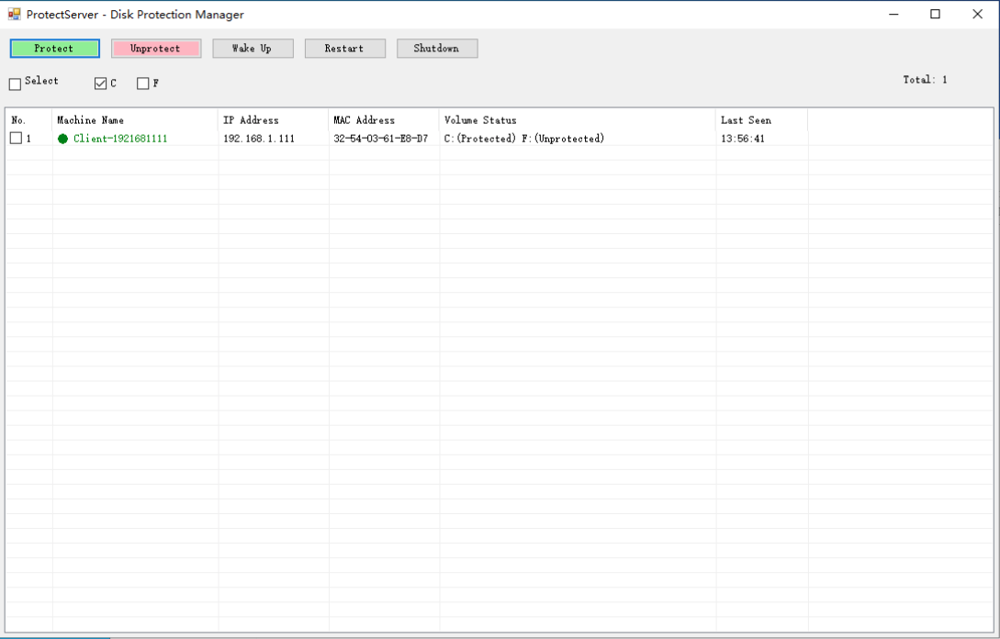
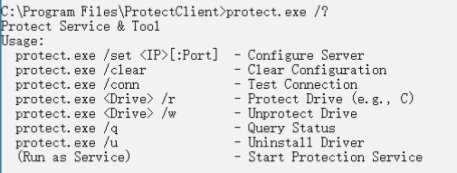

**Version / 版本: 2.5**

---Only Win10 22h2 and Win11 25H2 were tested, and the software only supports UEFI mode and not LegacyMBR mode

## 1. Introduction / 产品简介

*   **Diskflt** is an enterprise-grade Disk Filter Driver designed for Windows operating systems. It sits between the file system and the physical disk driver, intercepting all I/O requests to implement "Shadow Mode" protection. When protection is enabled, any changes made to the system (virus infections, software installations, file deletions) are redirected to a temporary storage area. Upon reboot, these temporary changes are discarded, instantly restoring the system to its pristine state.
*   **Diskflt** 是一款专为 Windows 操作系统设计的企业级磁盘过滤驱动程序。它位于文件系统和物理磁盘驱动之间，拦截所有 I/O 请求以实现“影子模式”保护。开启保护后，对系统的任何更改（病毒感染、软件安装、文件删除）都会被重定向到临时存储区域。重启后，这些临时更改将被丢弃，系统瞬间恢复到初始纯净状态。

## 2. Application Scenarios / 应用场景

### 2.1 Public Access Terminals / 公共终端
*   Libraries, Hotels, Kiosks. Ensure user privacy and system stability by resetting the OS after every session.
*   图书馆、酒店、查询机。通过每次会话后重置操作系统，确保用户隐私和系统稳定性。

### 2.2 Educational Institutions / 教育机构
*   Computer Labs, Schools. Prevent students from accidentally modifying system settings or installing unauthorized software. Teachers can easily restore a clean environment for the next class via remote command.
*   计算机实验室、学校。防止学生意外修改系统设置或安装未经授权的软件。教师可以通过远程指令轻松为下一节课恢复纯净环境。

### 2.3 Software Testing / 软件测试
*   QA Environments. Developers can test malware or unstable software safely. A simple reboot removes all traces of the test execution.
*   QA 环境。开发人员可以安全地测试恶意软件或不稳定软件。简单的重启即可清除所有测试痕迹。

### 2.4 Enterprise Security / 企业安全
*   Corporate Workstations. Prevent APT attacks and ransomware persistence. Even if infected, the malware cannot survive a reboot.
*   企业工作站。防止 APT 攻击和勒索软件持久化。即使感染，恶意软件也无法在重启后存活。

## 3. Technical Architecture & Principles / 技术架构与原理

### 3.1 System Architecture / 系统架构

The system consists of three layers / 系统由三层组成：

*   **Kernel Level (diskflt.sys)**: A WDM Upper Filter Driver that attaches to the Disk Class Driver stack. It handles sector-level I/O interception.
    *   **内核层 (diskflt.sys)**：一个 WDM 上层过滤驱动，附加在磁盘类驱动堆栈上。负责扇区级的 I/O 拦截。
*   **Service Level (protect.exe)**: A Windows Service that manages the driver, handles network communication (TCP/UDP), and persists configuration to the physical disk.
    *   **服务层 (protect.exe)**：一个 Windows 服务，负责管理驱动，处理网络通信（TCP/UDP），并将配置持久化到物理磁盘。
*   **Management Level (ProtectServer.exe)**: A centralized console for discovering and managing multiple clients across the LAN.
    *   **管理层 (ProtectServer.exe)**：一个集中控制台，用于发现和管理局域网内的多个客户端。

### 3.2 Core Principles / 核心原理

#### A. Redirect-on-Write (ROW) / 写重定向
When a write request (IRP_MJ_WRITE) is sent to a protected volume, the driver intercepts it. Instead of writing to the physical sectors, it redirects the data to a RAM buffer or a temporary file. It marks these sectors as "dirty" in a bitmap. The OS believes the write succeeded.
当写入请求 (IRP_MJ_WRITE) 发送到受保护卷时，驱动程序会将其拦截。它不会写入物理扇区，而是将数据重定向到内存缓冲区或临时文件。它会在位图中将这些扇区标记为“脏”。操作系统会认为写入已成功。

#### B. Read Redirection / 读重定向
When a read request (IRP_MJ_READ) occurs, the driver checks the bitmap. If the sector is "dirty" (modified), data is served from the temporary storage. If not, data is read from the actual physical disk. This ensures data consistency during the session.
当发生读取请求 (IRP_MJ_READ) 时，驱动程序会检查位图。如果扇区是“脏”的（已修改），则从临时存储提供数据。如果不是，则从实际物理磁盘读取数据。这确保了会话期间的数据一致性。

#### C. Configuration Persistence (Sector 62) / 配置持久化 (62号扇区)
To prevent configuration loss (since the registry itself might be protected and reset on reboot), configuration data (Server IP, Protection Status) is written directly to **Physical Sector 62** of Disk 0. The driver reads this sector during the boot phase (before the file system loads) to determine protection policies.
为了防止配置丢失（因为注册表本身可能受保护并在重启时重置），配置数据（服务器 IP、保护状态）直接写入磁盘 0 的 **物理扇区 62**。驱动程序在启动阶段（文件系统加载之前）读取此扇区以确定保护策略。

### 3.3 Execution Flowchart / 执行流程图

```
[App/OS Write Request]
       |
       v
[ Diskflt Driver Intercept ]
       |
   Is Volume Protected?
   /          \
 YES           NO
  |             |
  v             v
[Write to Temp] [Passthrough to Physical Disk]
  |             |
[Update Bitmap] |
  |             |
  v             v
[ Complete Request (Success) ]
```

## 4. Installation & Deployment / 安装与部署

1.  Run "install.bat" as Administrator on Client Machine.
    在客户机上以管理员身份运行 "install.bat"。
    *   Copies files to `C:\Program Files\ProtectClient`
    *   Registers `diskflt.sys` as UpperFilter
    *   Starts `ProtectSvc` Service
2.  Reboot the computer.
    重启计算机。

## 5. Protect Client Manual / 客户端使用说明

The client `protect.exe` runs as a background service but also accepts command-line arguments for management.
客户端 `protect.exe` 作为后台服务运行，但也接受命令行参数进行管理。

### Commands / 常用命令

| Command / 命令 | Description / 描述 |
| :--- | :--- |
| `protect.exe /set 192.168.1.100` | Set Server IP manually. Triggers immediate reconnect.<br>手动设置服务端 IP。触发立即重连。 |
| `protect.exe C /r` | Enable Protection for Drive C (Restore Mode). Requires Reboot.<br>开启 C 盘保护（还原模式）。需要重启。 |
| `protect.exe C /w` | Disable Protection for Drive C (Write Mode). Requires Reboot.<br>关闭 C 盘保护（写入模式）。需要重启。 |
| `protect.exe /q` | Query current protection status.<br>查询当前保护状态。 |

## 6. ProtectServer Manual / 服务端使用说明

Run `ProtectServer.exe` to manage clients. No installation required.
运行 `ProtectServer.exe` 即可管理客户端。无需安装。

### Features / 功能

*   **Auto Discovery / 自动发现**: Uses UDP Broadcast (Port 3000) to find clients in the same VLAN. Clients automatically connect without manual IP configuration.
    *   使用 UDP 广播（端口 3000）发现同一 VLAN 内的客户端。客户端无需手动配置 IP 即可自动连接。
*   **Batch Management / 批量管理**: Select multiple clients to Protect, Unprotect, Restart, or Shutdown simultaneously.
    *   选择多个客户端同时进行保护、取消保护、重启或关机。
*   **Wake-on-LAN / 远程唤醒**: Send Magic Packets to wake up offline machines (Requires BIOS/NIC support).
    *   发送魔术包唤醒离线机器（需要 BIOS/网卡支持）。

## 7. FAQ / 常见问题

**Q: Why do changes disappear after reboot? / 为什么重启后修改消失了？**
This is the intended behavior of Protection Mode (/r). To save files permanently, switch to Write Mode (/w) or save to an unprotected partition (e.g., D:).
这是保护模式 (/r) 的预期行为。要永久保存文件，请切换到写入模式 (/w) 或保存到未保护的分区（如 D:）。

**Q: Driver not loading? / 驱动未加载？**
Ensure Secure Boot is DISABLED in BIOS and TestSigning is ON. This driver uses a test signature.
确保 BIOS 中已禁用安全启动 (Secure Boot)，并且已开启 TestSigning。此驱动使用测试签名。

---
&copy; 2026 Diskflt Development Team
